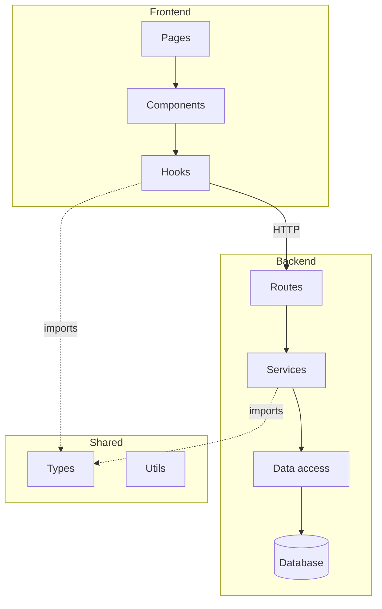

# Architecture

Run a full codebase architecture audit. Produces a structured report
covering what's drifted, what's coupled, what's missing, and what's
working well. Updates `.context/PROJECT.md` with the architecture section.

Different from the `architecture-reviewer` skill which reviews specific
decisions — this command audits the entire codebase as it stands today.

---

## Usage

```
/architecture                    ← full audit, all areas
/architecture frontend           ← frontend layer only
/architecture backend            ← backend layer only
/architecture boundaries         ← cross-boundary analysis only
/architecture diagram            ← generate full system diagram
/architecture update             ← re-audit and update PROJECT.md
```

---

## Step 1 — Establish scope

Determine which packages and layers to audit based on the argument.
If no argument: audit everything.

Read in order:
1. `.context/PROJECT.md` architecture section — what was documented before
2. Root folder structure — what actually exists
3. Each package's `package.json` — dependencies reveal coupling
4. Key files in each layer — 3-5 files per layer to understand real patterns

---

## Step 2 — Map the actual architecture

Produce a map of what exists, layer by layer. Do not rely on what the
code is supposed to do — read what it actually does.

For each package/app:
- What is its stated purpose?
- What does it actually contain?
- What does it depend on?
- What depends on it?

Identify:
- All layers (frontend / backend / shared / infra / etc.)
- All modules within each layer
- All cross-layer dependencies

---

## Step 3 — Run the four audits

### Audit 1 — Boundary integrity

For every cross-layer or cross-module import, classify it:

| Import | From | To | Expected? | Verdict |
|--------|------|----|-----------|---------|
| `import X from '../services/auth'` | controller | service | Yes | ✅ |
| `import db from '../../db'` | controller | database | No | 🔴 Violation |
| `import UserComponent from '@app/frontend'` | backend | frontend | No | 🔴 Violation |

Violations by severity:
- 🔴 **Critical** — wrong-direction dependency (frontend → backend internals,
  controller → DB, service → UI)
- 🟡 **Major** — crossing a boundary that should be respected
  (feature A importing feature B's internals directly)
- 🔵 **Minor** — acceptable but worth watching
  (shared utility that could become a shared type)

### Audit 2 — Coupling analysis

Find modules that are imported by many others — these are coupling hotspots:

```bash
# Find the most-imported files (works on macOS and Linux)
rg -o "from '[^']+'" --type ts --type tsx --no-filename | \
  sort | uniq -c | sort -rn | head -20
```

For each hotspot: is this coupling intentional (a shared utility is
supposed to be imported everywhere) or accidental (a god object that
grew without a plan)?

### Audit 3 — Drift detection

Scan for the most common drift patterns across the whole codebase:

**Layer drift:**
- Business logic outside service layer
- Direct DB access outside data layer
- UI state in backend code
- Shared package importing from app packages

**Naming drift:**
- Same concept named differently in different places
- File names that don't match their contents
- Inconsistent folder naming conventions across packages

**Size drift:**
- Files over 300 lines — candidates for splitting
- Folders with more than 20 files and no sub-organisation
- `utils/` or `helpers/` folders with unrelated accumulation

**Test drift:**
- Test files that import deep internals instead of public API
- Missing test files for critical paths
- Test fixtures that duplicate production data

### Audit 4 — Missing architecture

What is absent that should exist?

Common gaps:
- No explicit error handling layer (errors handled inconsistently everywhere)
- No validation layer (validation scattered across routes and services)
- No logging strategy (some files log, most don't)
- No shared type definitions for API contracts (each side defines its own)
- No explicit public API per module (everything is exported, nothing is encapsulated)

---

## Step 4 — Generate the full system diagram

Produce a Mermaid diagram showing the real architecture (not the ideal one).
Adapt the structure to the actual project layout — the template below is
illustrative only. Read the project's directories before generating.



Mark any violations found in Audit 1 directly on the diagram.

---

## Step 5 — Produce the audit report

```
## Architecture audit — [date]

### System overview
[2-3 sentences describing the overall structure as it actually exists]

---

### Layer map
[Table of all layers, their purpose, and their health]

| Layer | Location | Purpose | Health |
|-------|----------|---------|--------|
| [name] | [actual path] | [actual purpose] | [assessment] |

---

### Boundary violations

[Audit 1 findings]

---

### Coupling hotspots

[Audit 2 findings — most-imported files and whether coupling is intentional]

---

### Drift findings

[Audit 3 findings — layer drift, naming drift, size drift, test drift]

---

### Missing architecture

[Audit 4 findings — what should exist but doesn't]

---

### Architecture diagram

[Mermaid diagram from Step 4]

---

### What's working well
[Specific patterns done correctly — be precise, not generic]

---

### Priority actions

| Priority | Action | Effort | Skill to use |
|----------|--------|--------|-------------|
| P1 | [fix critical violation] | S | refactor-guide |
| P2 | [address major drift] | M | refactor-guide |
| P3 | [add missing layer] | L | architecture-advisor agent |

---

### ADRs recommended
[Any decisions that emerged from this audit that should be documented]
- [ ] [Decision] → invoke adr-writer
```

---

## Step 6 — Update PROJECT.md

Update `.context/PROJECT.md` architecture section with:
- The layer map produced in this audit
- The key patterns established
- Any violations being tracked as known debt
- Link to the generated diagram

This makes the architecture visible to every future agent and developer
without them needing to re-audit.

---

## Relationship to other commands and skills

| Tool | When to use |
|------|-------------|
| `/architecture` | Full audit — run before major sprints or quarterly |
| `architecture-reviewer` skill | Specific decisions during development |
| `architecture-advisor` agent | Consult during orchestrator planning phase |
| `adr-writer` skill | Document decisions surfaced by this audit |
| `refactor-guide` skill | Fix violations found by this audit |
| `debt-tracker` agent | Track architectural debt items as D-NNN IDs |