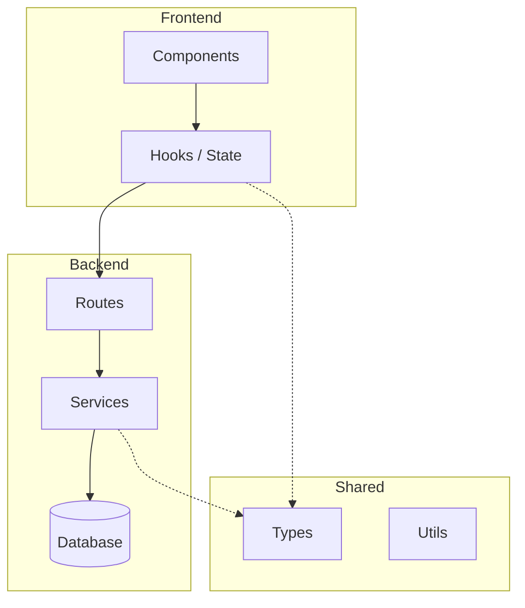
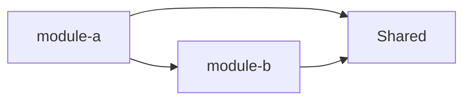
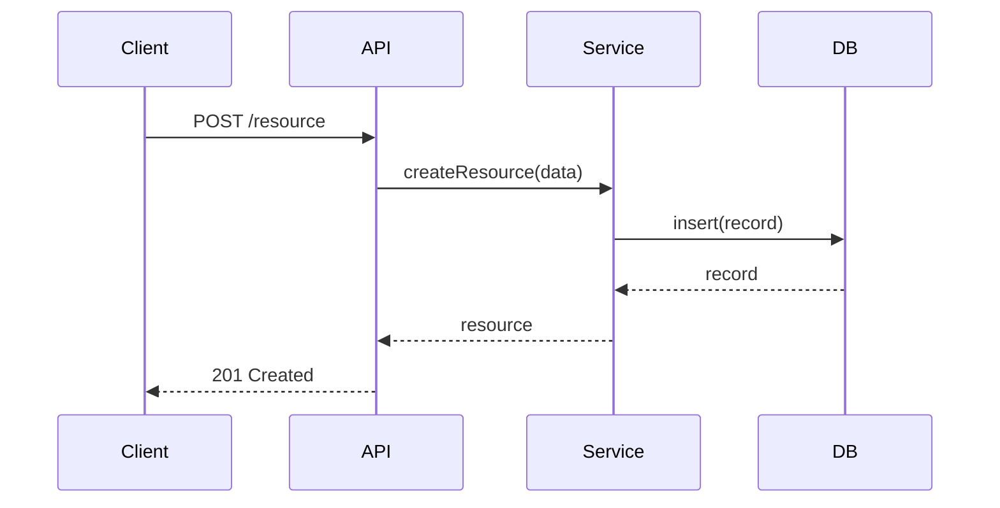

# Architecture reviewer

## Purpose
Make structural decisions with confidence — where new code belongs, whether
a proposed design is sound, where drift has crept in, and how the system
fits together. Architecture problems are the most expensive to fix late.
This skill catches them early.

---

## Core principles

**Boundaries are the architecture.** The most important architectural
decision in any system is not what technology to use — it's where the
boundaries are and what can cross them. Every review starts by asking:
does this respect the existing boundaries, or does it erode them?

**Drift compounds.** One shortcut that puts business logic in a controller
is harmless. Twenty of them and you have no service layer. Detecting drift
early, when it's a single file, is the entire value of architectural review.

**Diagrams are questions made visible.** A diagram that looks clean usually
is clean. A diagram with many arrows crossing many layers is a question:
is this coupling intentional?

---

## Step 1 — Establish the current architecture

Before evaluating anything, read the existing structure:

1. Read `.context/PROJECT.md` if it exists — architecture section first
2. Explore the top-level folder structure
3. Identify the layers: what are the named boundaries? (frontend / backend /
   shared, or feature modules, or service boundaries)
4. Identify the established patterns: where does business logic live?
   Where do data types live? Where do utilities live?
5. Read 2-3 existing files in the relevant area to understand the actual
   pattern, not just the intended one

If `.context/PROJECT.md` has no architecture section, note it — the
architecture command should be run to establish a baseline.

---

## Step 2 — Apply the right review mode

Based on what triggered this skill, apply one of four modes:

---

### Mode A — Placement review
*Trigger: "where should this live", "which layer", adding new code*

Answer these questions in order:

1. **What is this thing?** Is it a UI concern, a business rule, a data
   transformation, an infrastructure adapter, or a shared contract?

2. **Which layer owns this type of thing?**
   - UI concerns → frontend, component layer
   - Business rules → backend service layer, never controllers
   - Data transformation → service layer or a dedicated transformer
   - Infrastructure adapters → infrastructure layer (DB, external APIs)
   - Shared contracts → shared package, only if used on both sides

3. **Does an existing module own this?** Check before creating a new one.
   New modules are a commitment — they need tests, docs, and maintenance.

4. **If a new module is needed:** name it after what it does, not what it
   contains. `user-notifications` not `notification-helpers`.

Output format:
```
## Placement recommendation

This belongs in: [specific path recommendation]
Because: [one sentence — what type of thing it is and which layer owns it]

Alternative considered: [if applicable]
Why rejected: [one sentence]

Watch for: [any coupling risk if placed here]
```

---

### Mode B — Design evaluation
*Trigger: "is this the right structure", "how should I design this", planning phase*

Evaluate the proposed design across four dimensions:

**1. Boundary integrity**
- Does each component have one clear responsibility?
- Are there any circular dependencies (A depends on B depends on A)?
- Does any component know too much about another's internals?
- Does this design require any existing boundary to bend?

**2. Scalability of the design**
- If this feature doubles in scope, does the design still hold?
- Are there any assumptions baked in that will become constraints?
- Is there a simpler design that gets to 80% of the outcome?

**3. Consistency with existing patterns**
- Does this introduce a new pattern where an existing one would work?
- If a new pattern is genuinely needed, is it worth the inconsistency cost?
- Would a new developer understand this without being told?

**4. Reversibility**
- If this turns out to be wrong, how hard is it to undo?
- Are the expensive-to-reverse decisions (DB schema, public API shape,
  shared package types) being made carefully?

Output format:
```
## Design evaluation

### Verdict: Sound / Concerns / Rethink

**Boundary integrity:** ✅ / ⚠️ [issue]
**Scalability:** ✅ / ⚠️ [issue]
**Consistency:** ✅ / ⚠️ [issue]
**Reversibility:** ✅ / ⚠️ [issue]

### Key concern (if any)
[The one thing most worth addressing before implementing]

### Suggested adjustment (if needed)
[Specific change to the proposed design — not a rewrite, a targeted fix]

### ADR recommended?
Yes / No — [reason if yes]
```

---

### Mode C — Drift detection
*Trigger: refactor crossing boundaries, PR touching 3+ areas*

Scan the relevant files for these drift patterns:

**Layer violations:**
- Business logic in controllers or route handlers
- UI logic in service layer
- Direct DB queries outside the data access layer
- Shared package importing from frontend or backend packages

**Coupling violations:**
- Feature A importing directly from Feature B's internals
- Shared mutable state between modules
- Event handlers that know too much about the emitting module
- God objects — single files/modules that everything imports from

**Naming drift:**
- Inconsistent naming conventions across similar concepts
  (some files say `UserService`, others say `userHelper`, others say `user-utils`)
- Files growing beyond one responsibility without being split

**Accumulation patterns:**
- `utils/` folders with unrelated things lumped together
- `types/` files with types that belong in specific modules
- Test files that test implementation details instead of behaviour

Output format:
```
## Drift report

### Violations found

| Severity | File | Violation | Fix |
|----------|------|-----------|-----|
| 🔴 Critical | path/file.ts | [violation] | [fix] |
| 🟡 Major | path/file.ts | [violation] | [fix] |
| 🔵 Minor | path/file.ts | [violation] | [fix] |

### Pattern assessment
[Is this isolated drift, or evidence of a systemic problem?]

### Recommended action
[Immediate fix vs. planned refactor vs. document as accepted debt]
```

---

### Mode D — Diagram generation
*Trigger: "generate architecture diagram", "document the structure", "visualise"*

Generate a Mermaid diagram appropriate to the scope requested.

**For system overview:**


**For module relationships:**


**For data flow:**


After generating the diagram, annotate it:
- Mark any boundary crossings that look concerning
- Note any missing layers that the diagram reveals
- Suggest whether this should be saved to `.context/` or `docs/`

---

## Step 3 — ADR recommendation

After any Mode A, B, or C review, assess whether an ADR is warranted:

Write an ADR if:
- A new pattern is being introduced
- An existing boundary is being consciously changed
- A significant technology or structural choice is being made
- Future developers would reasonably ask "why was it done this way?"

If an ADR is warranted, state:
```
## ADR recommended

Decision: [one sentence]
Invoke: adr-writer skill — "Write an ADR for [decision]"
```

---

## Examples

### Example 1 — Placement question
**User:** "I need to add email validation logic. Where does it go?"

**Actions:**
1. Determine type: validation of user input — business rule
2. Check: does a validation module/service exist?
3. If yes: add to it
4. If no: recommend `services/validation.ts` or equivalent
5. Flag: if they put it in the route handler, that's a Layer violation

### Example 2 — New feature planning
**User:** "I'm planning to add a notification system. Here's my rough design..."

**Actions:**
1. Mode B — design evaluation
2. Check: where does notification logic live? Backend service
3. Check: does the frontend need to react to notifications? Shared event type
4. Check: does this introduce a new pattern or follow existing ones?
5. Flag if: notifications are being put in the frontend, or if a new DB
   table is being added without a migration plan

### Example 3 — PR touching auth, payments, user profile, and notifications
**Actions:**
1. Mode C — drift detection
2. Large surface area is the trigger — check for shortcuts taken under time pressure
3. Check each area for layer violations
4. Assess: is this genuinely a cross-cutting feature or scope creep?

---

## Troubleshooting

**User disagrees with placement recommendation:**
Walk through the type classification together. If the disagreement is
about what type of thing this is, that's the real question to resolve.

**Architecture is genuinely unclear — no established patterns:**
Say so. Recommend running `/architecture` command to establish a baseline
before adding more code to an undefined structure.

**New module clearly needed but naming is hard:**
Hard naming usually means the module's responsibility isn't clear yet.
Ask: "what is the one thing this module is responsible for?" The name
follows from the answer.