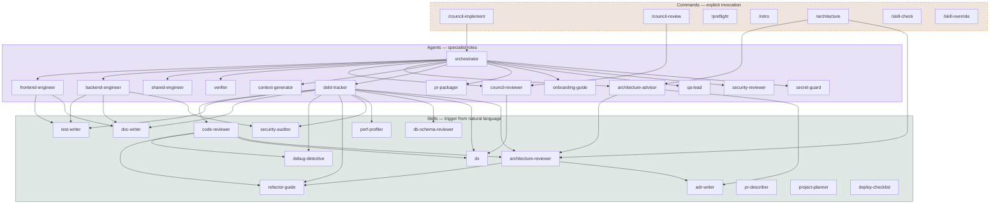
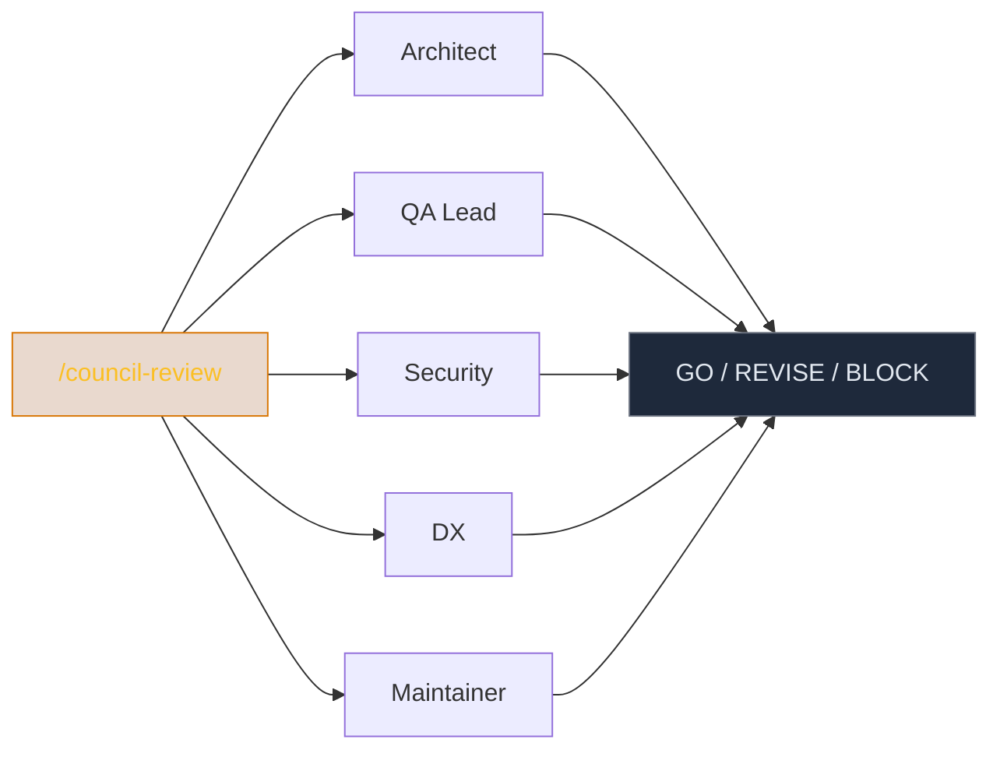

# eng-workflows

AI-powered engineering workflows for Claude and Cursor. **14 skills**, **14 agents**, **7 commands** — covering code review, testing, debugging, security, architecture, deployment, and more.

[**Live explorer (SkillFlow)**](https://skillflow.vercel.app) · [Guide](/src/app/guide/page.tsx)

---

## Architecture



---

## Quick start

```bash
# Clone and run the SkillFlow explorer
git clone https://github.com/sagunji/eng-workflows.git
cd eng-workflows
npm install && npm run dev
```

To use the workflows in **your own project**, copy the directories you need:

```bash
cp -r .claude/skills/ your-project/.claude/skills/
cp -r .cursor/agents/ your-project/.cursor/agents/
cp -r .claude/commands/ your-project/.claude/commands/
```

---

## Commands

| Command | What it does |
|---------|-------------|
| `/council-implement [task]` | Full build workflow — plan, parallel agents, cross-review, verify, council review |
| `/council-review` | Five-role quality gate (architect, QA, security, DX, maintainer) |
| `/preflight` | Pre-commit check — secrets, debug artefacts, test alignment, diff sanity |
| `/architecture [scope]` | Full codebase architecture audit — drift, coupling, gaps, strengths |
| `/retro [type]` | Structured retrospective (sprint / incident / feature) |
| `/skill-check` | Validate a SKILL.md before committing |
| `/skill-override [skill] "[rule]"` | Persistent customisation of any skill |

---

## Agents

| Agent | Role |
|-------|------|
| **orchestrator** | Decomposes tasks, builds plans, dispatches agents. Never writes code. |
| **frontend-engineer** | React/Next.js — components, pages, hooks, tests |
| **backend-engineer** | API routes, services, validation, auth guards |
| **shared-engineer** | Shared types and utilities across FE/BE |
| **verifier** | Type check, lint, test, build, fresh-clone simulation |
| **council-reviewer** | Five-role quality gate with GO / REVISE / BLOCK verdict |
| **architecture-advisor** | Read-only structural review before implementation begins |
| **qa-lead** | Test coverage gaps, untested paths, weak assertions |
| **security-reviewer** | Traces user input to output, concrete exploitation paths |
| **secret-guard** | Scans for hardcoded secrets and credentials |
| **context-generator** | Builds/updates `.context/PROJECT.md` with project knowledge |
| **debt-tracker** | Scans TODOs, FIXMEs, skipped tests, large files, `any` types |
| **pr-packager** | Preflight + PR description + deploy checklist in one pass |
| **onboarding-guide** | Generates a getting-started guide for new developers |

---

## Skills

| Skill | Trigger phrases | Category |
|-------|----------------|----------|
| **code-reviewer** | "review this", "check my code", "look at this PR" | Quality |
| **test-writer** | "write tests", "add test coverage", "test this function" | Testing |
| **debug-detective** | "it's not working", "I'm getting an error", "this crashes" | Debugging |
| **refactor-guide** | "refactor this", "clean this up", "this function is too big" | Quality |
| **perf-profiler** | "this is slow", "queries are too long", "page is sluggish" | Performance |
| **security-auditor** | "security audit", "is this secure", "check for vulnerabilities" | Security |
| **db-schema-reviewer** | "review this migration", "check my schema" | Database |
| **architecture-reviewer** | "where should this live", "is this the right structure" | Architecture |
| **dx** | "improve the DX", "this is confusing", "make this easier" | Quality |
| **doc-writer** | "write a README", "document this", "add docstrings" | Documentation |
| **adr-writer** | "write an ADR", "document this decision" | Documentation |
| **pr-describer** | "write a PR description", "PR for these changes" | Documentation |
| **project-planner** | "plan this project", "break this into tasks" | Planning |
| **deploy-checklist** | "deploying to production", "ready to ship" | Operations |

---

## Workflow examples

### Ship a feature


### Fix a production bug


### Review before merging



---

## Project structure

```
.claude/
├── commands/           ← slash commands (7)
│   ├── architecture.md
│   ├── council-implement.md
│   ├── council-review.md
│   ├── preflight.md
│   ├── retro.md
│   ├── skill-check.md
│   └── skill-override.md
└── skills/             ← auto-triggering skills (14)
    ├── adr-writer/
    ├── architecture-reviewer/
    ├── code-reviewer/
    ├── db-schema-reviewer/
    ├── debug-detective/
    ├── deploy-checklist/
    ├── doc-writer/
    ├── dx/
    ├── pref-profiler/
    ├── pr-describer/
    ├── project-planner/
    ├── refactor-guide.md/
    ├── security-auditor/
    └── test-writer/

.cursor/
└── agents/             ← specialist roles (14)
    ├── architecture-advisor.md
    ├── backend-engineer.md
    ├── context-generator.md
    ├── council-reviewer.md
    ├── debt-tracker.md
    ├── frontend-engineer.md
    ├── onboarding-guide.md
    ├── orchestrator.md
    ├── pr-packager.md
    ├── qa-lead.md
    ├── secret-guard.md
    ├── security-reviewer.md
    ├── shared-engineer.md
    └── verifier.md

src/                    ← SkillFlow explorer app (Next.js)
├── app/
│   ├── page.tsx                    landing page
│   ├── guide/page.tsx              usage guide
│   ├── dashboard/page.tsx          entity cards view
│   └── dashboard/graph/page.tsx    interactive graph
├── components/
└── hooks/
```

---

## SkillFlow

The repo includes **SkillFlow** — an interactive Next.js app that visualises how all skills, agents, and commands connect. Browse entities, read their source, download what you need.

```bash
npm run dev        # start dev server
npm run sync       # regenerate graph.json from source files
npm run build      # production build
```

---

## License

MIT
